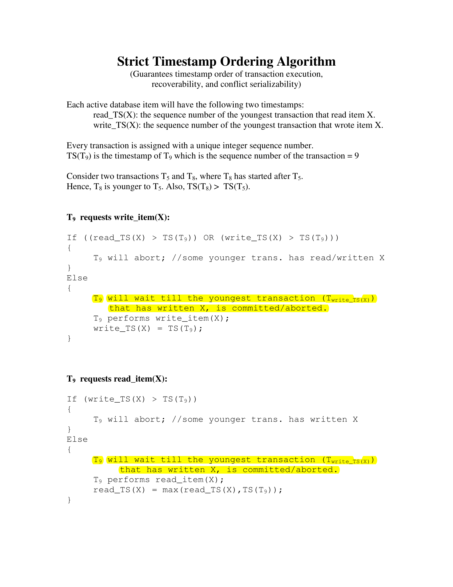

# Timestamp-Based Concurrency Control (DBMS)

---

## Table of Contents

- [Intro](#intro)
- [What is Timestamping](#what-is-timestamping)
- [Why Timestamping Matters](#why-timestamping-matters)
- [Basic Example](#basic-example)
- [Questions](#questions)
- [Rules](#rules)
- [Read Rule](#read-rule)
- [Write Rule](#write-rule)
- [Basic Example 2](#basic-example-2)
- [Conflict Handling](#conflict-handling)
- [Questions](#questions)
- [Strict Timestamp](#strict-timestamp)
- [Strict Read/Write](#strict-readwrite)
- [Benefits and Issues](#benefits-and-issues)
- [Overall Summary](#overall-summary)
- [Practice](#practice)

---

## Intro 

Concurrency control keeps multiple transactions from interfering when running in parallel.

Timestamp-based concurrency control avoids locks.  
Instead of blocking, it orders transactions by time.  
Older transactions logically come first.

This keeps execution logically consistent.

---

## What is Timestamping 

Each transaction T receives a unique timestamp at start.

Example:

TS(T1) = 5  
TS(T2) = 10  

T1 is older, so T1’s actions appear earlier in the final schedule.

---

## Why Timestamping Matters 

- No locks
- No deadlocks
- Conflicts handled automatically
- Execution follows timestamp order

Older = higher priority.

---

## Basic Example 

Two transactions want X:

- T1 writes X
- T2 writes X

If ordering is violated, younger transaction may abort and restart.

Older wins. Database remains consistent.

---

## Questions 

---

### Q1. Why do we avoid deadlocks here?

---

### Q1. Why do we avoid deadlocks here?
> Because there are no locks involved.

---

### Q2. What tells us who is older?

---

### Q2. What tells us who is older?
> Timestamp assigned at start.

---

### MCQ: If TS(T1) < TS(T2), who has priority?
A. T1  
B. T2  

---

### MCQ: If TS(T1) < TS(T2), who has priority?
A. T1  
B. T2  
> Correct: A

---

## Rules 

Timestamp ordering uses:

- R_TS(X): last read timestamp  
- W_TS(X): last write timestamp  

These decide whether a new operation is safe or must abort.

---

## Read Rule 

Transaction T does R(X):

If W_TS(X) > TS(T), then abort T.  
Else read and set R_TS(X).

Meaning:  
If a younger transaction already wrote X, older T reading now would read the future. Abort to preserve order.

---

## Write Rule 

Transaction T does W(X):

If R_TS(X) > TS(T) or W_TS(X) > TS(T), abort T.  
Else write and update W_TS(X).

Younger touching X earlier makes older writes unsafe.

---

## Basic Example 2 

Let:
- TS(T1) = 5
- TS(T2) = 10

Suppose T2 writes X first ⇒ W_TS(X)=10  
Now T1 tries R(X): W_TS(X)=10 > TS(T1)=5  

T1 would read a future value. Abort T1.

---

## Conflict Handling 

- Younger usually loses  
- Older has priority  

This preserves serializable order.

---

## Questions 

---

### Q1. Why do we abort T when reading future values?

---

### Q1. Why do we abort T when reading future values?
> To keep older-first logical order.

---

### MCQ: If a younger transaction already wrote X, an older transaction trying to read should
A. Read  
B. Abort  
C. Wait  
D. Ignore  

---

### MCQ: If a younger transaction already wrote X, an older transaction trying to read should
A. Read  
B. Abort  
C. Wait  
D. Ignore  
> Correct: B

---

### MCQ: Which timestamp tracks last write
A. R_TS  
B. W_TS  

---

### MCQ: Which timestamp tracks last write
A. R_TS  
B. W_TS  
> Correct: B

---

## Strict Timestamp 

Basic timestamping aborts aggressively and may cause cascading aborts.

Strict TO delays operations until safe, reducing cascading aborts.

---



---

## Strict Read/Write 

Strict Read:
- W_TS(X) <= TS(T)
- Writer committed

Strict Write:
- R_TS(X) <= TS(T)
- W_TS(X) <= TS(T)
- Prior readers/writers committed

If not safe, T waits instead of aborting.

---

## Benefits and Issues 

Benefits:
- Conflict serializable
- No locks, no deadlocks
- Strict TO avoids cascading aborts

Issues:
- Newer transactions may starve
- Checks add overhead

---

## Overall Summary 

Timestamp ordering decides execution order via timestamps, not locks.

- Older transactions have priority
- Basic TO aborts unsafe actions
- Strict TO waits to avoid cascading aborts
- Uses R_TS and W_TS
- No deadlocks without locks

---

## Practice 

---

1. Purpose of timestamps in concurrency control  
2. Meaning of reading a future value  

---

### MCQ: Timestamp ordering is mainly for
A. Locking  
B. Enforcing logical order  
C. Allowing dirty reads  
D. Random execution  

---

### MCQ: Timestamp ordering is mainly for
A. Locking  
B. Enforcing logical order  
C. Allowing dirty reads  
D. Random execution  
> Correct: B

---

### MCQ: Cascading aborts happen because
A. Too many locks  
B. Writes without commit confirmation  
C. Old values overwritten instantly  
D. Timestamps wrong  

---

### MCQ: Cascading aborts happen because
A. Too many locks  
B. Writes without commit confirmation  
C. Old values overwritten instantly  
D. Timestamps wrong  
> Correct: B

---

### Bibliography

> [users.cs.fiu](https://users.cs.fiu.edu/~prabakar/database/cmaps/mod_04/StrictTO.pdf)

> [geeksforgeeks](https://www.geeksforgeeks.org/dbms/timestamp-based-concurrency-control/)

>[scaler](https://www.scaler.com/topics/timestamp-based-protocols-in-dbms/)

---

## Thank you for listening.
### Aborting after commit :

```bash
git add .
git commit -m "transaction commited"
git push -f origin main
```
